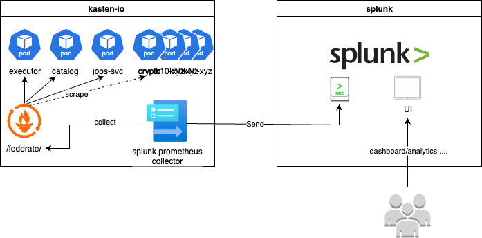
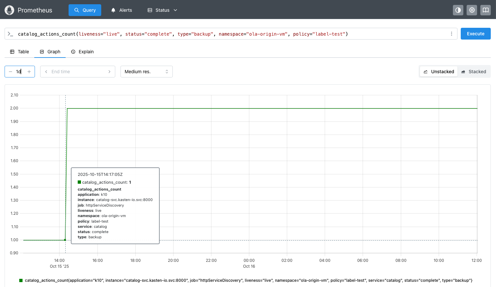
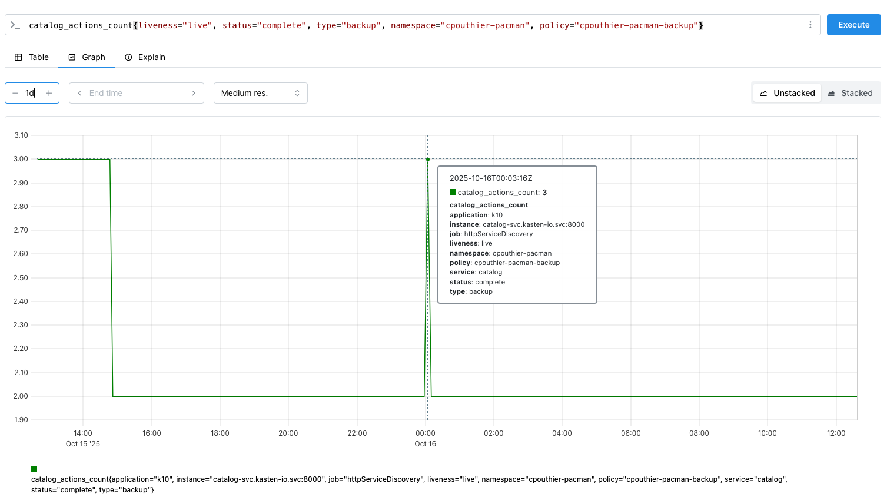
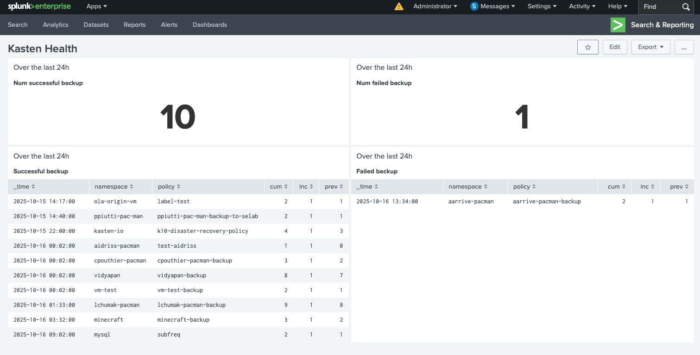

# Goal 

Show how to push and use built in prometheus metrics to splunk 

# Flows



- Every Kasten component emits metrics 
- Those metrics are scraped every 5s by Prometheus 
- Once scraped they can be retreived on the `fedrerate/` prometheus endpoint
- The Open telemetry collector use `federate/` to collect those metrics and send them to an index metrics in splunk
- Users can now use Splunk to monitor Kasten

# Steps

1. Optional if you don't have Splunk : Build a splunk instance on the same openshift cluter
2. Create an open telemetry collector (otel-collector) that will collect the prometheus metrics and send them to a metrics index in Splunk
3. Create Spluk Query Language (spl) request that reproduce prometheus query language (promql) that we usually use for Kasten monitoring 

## Building a splunk instance 

```
oc create -f splunk.yaml 
```

It will create a splunk instance in it's own namespace for openshift. During this install we setup a metric index called `k8s_metrics` and we also setup 
a secret for the splunk UI and for the HEC (HTTP Event Collector) endpoint. 

## Create an open telemetry collector in kasten-io 

Create the otel-collector in the kasten-io namespace 

```
oc create -f otel-collector.yaml
```

The collector will gather all metrics in the /federate endpoint of the built in prometheus server of Kasten and send them to splunk.

## Porting the prometheus request to Splunk 


### Check your metrics 

Check that kasten metrics are now inside the splunk `k8s_metrics` index

```
| mcatalog values(metric_name) as metrics WHERE index=k8s_metrics
```

output 
```
action_artifact_count
action_artifact_count_by_app
action_artifact_count_by_policy
action_backup_cluster_duration_seconds_overall_sum
action_backup_cluster_duration_seconds_sum
action_backup_cluster_ended_count
....
....
catalog_actions_count
catalog_persistent_volume_disk_space_available_bytes
catalog_persistent_volume_disk_space_used_bytes
catalog_persistent_volume_free_space_percent
catalog_repository_version_count
catalog_storage_artifact_count
....
....
snapshot_storage_size_bytes
store_operation_seconds_bucket
store_operation_seconds_count
store_operation_seconds_sum
up
```

### Matching the promethus model with the splunk model  

#### Discovering the dimensions 

 What in promethus is a `label` 
```
jobs_duration_bucket{application="k10", instance="jobs-svc.kasten-io.svc:8000", job="httpServiceDiscovery", le="1.0", service="jobs", status="succeeded"}	1464
jobs_duration_bucket{application="k10", instance="jobs-svc.kasten-io.svc:8000", job="httpServiceDiscovery", le="2.0", service="jobs", status="succeeded"}	1530
jobs_duration_bucket{application="k10", instance="jobs-svc.kasten-io.svc:8000", job="httpServiceDiscovery", le="5.0", service="jobs", status="succeeded"}	1806
jobs_duration_bucket{application="k10", instance="jobs-svc.kasten-io.svc:8000", job="httpServiceDiscovery", le="10.0", service="jobs", status="succeeded"}	1976
jobs_duration_bucket{application="k10", instance="jobs-svc.kasten-io.svc:8000", job="httpServiceDiscovery", le="30.0", service="jobs", status="succeeded"}	2331
jobs_duration_bucket{application="k10", instance="jobs-svc.kasten-io.svc:8000", job="httpServiceDiscovery", le="60.0", service="jobs", status="succeeded"}	3077
jobs_duration_bucket{application="k10", instance="jobs-svc.kasten-io.svc:8000", job="httpServiceDiscovery", le="120.0", service="jobs", status="succeeded"}	3337
....
jobs_duration_bucket{application="k10", instance="jobs-svc.kasten-io.svc:8000", job="httpServiceDiscovery", le="1.0", service="jobs", status="failed"}	0
jobs_duration_bucket{application="k10", instance="jobs-svc.kasten-io.svc:8000", job="httpServiceDiscovery", le="2.0", service="jobs", status="failed"}	0
jobs_duration_bucket{application="k10", instance="jobs-svc.kasten-io.svc:8000", job="httpServiceDiscovery", le="5.0", service="jobs", status="failed"}  0
```

become a `dimension` in splunk

```
| mcatalog values(_dims) WHERE metric_name=jobs_duration_bucket AND index=k8s_metrics
```

output
```
application
le
server.address
server.port
service
service.instance.id
service.name
status
url.scheme
```

However only `le` and `status` are interesting, because they are the only one that change. 

#### Matching the request 

If you want to get the number of job having a duration under 60s whether they fail or succeed you would write this request in promql
```
jobs_duration_bucket{status=~"(failed|succeeded)", le="60.0"}
```

ouput
```
jobs_duration_bucket{application="k10", instance="jobs-svc.kasten-io.svc:8000", job="httpServiceDiscovery", le="60.0", service="jobs", status="succeeded"}	
3082
jobs_duration_bucket{application="k10", instance="jobs-svc.kasten-io.svc:8000", job="httpServiceDiscovery", le="60.0", service="jobs", status="failed"}	
111
```

But to get the same result in spl you have to go with dimension and a span greater than the current period to make sure you get the latest metrics available in this bins
```
| mstats latest(_value) as num_jobs_under_60s WHERE index=k8s_metrics metric_name="jobs_duration_bucket" le=60 span=24h earliest=-1h latest=now BY status
```

output 
```
_time	    status	    num_jobs_under_60s
2025-10-16	failed	    111
2025-10-16	succeeded	3082
```

Notice that I fixed the window time `earliest=-1h latest=now`, hence any change you do in the UI time picker won't have any impact on the result.

> **Important Advice**: never use something like `| mstats sum(_value) ....` on an imported prometheus **counter** metrics because you're going to sum the same counter imported x times 
> during the bins. The result will just be absurd. 
>
> For instance 
> ```
> | mstats sum(_value) as num_jobs_under_60s WHERE index=k8s_metrics metric_name="jobs_duration_bucket" le=60 span=24h earliest=-1h latest=now BY status
> ```
> 
> ouput 
> ```
> _time         status      num_jobs_under_60s
> 2025-10-16    failed      6513.000000
> 2025-10-16    succeeded   181716.000000
> ```
> which is absurd ... **When counter are imported you need to catch the last counter in the bins**.


### Important request to build a  splunk dashboard

Unfortunately there is no magic trick to convert a promethus request into a splunk request. Beside, depending of the information you need to extract, map or display you'll build 
your request differently.

This section discuss the building of a useful dashboard to monitor Kasten 

#### Get the successful backup over the last 24h 

With prometheus you would do 
```
increase(catalog_actions_count{liveness="live", status="complete", type="backup"}[24h])>0
```

ouput
```
{application="k10", instance="catalog-svc.kasten-io.svc:8000", job="httpServiceDiscovery", liveness="live", namespace="aidriss-pacman", policy="test-aidriss", service="catalog", status="complete", type="backup"}	
1.0000846652768125
{application="k10", instance="catalog-svc.kasten-io.svc:8000", job="httpServiceDiscovery", liveness="live", namespace="cpouthier-pacman", policy="cpouthier-pacman-backup", service="catalog", status="complete", type="backup"}	
5.0034746351633075
{application="k10", instance="catalog-svc.kasten-io.svc:8000", job="httpServiceDiscovery", liveness="live", namespace="kasten-io", policy="k10-disaster-recovery-policy", service="catalog", status="complete", type="backup"}	
4.002779708130646
{application="k10", instance="catalog-svc.kasten-io.svc:8000", job="httpServiceDiscovery", liveness="live", namespace="lchumak-pacman", policy="lchumak-pacman-backup", service="catalog", status="complete", type="backup"}	
9.006254343293953
{application="k10", instance="catalog-svc.kasten-io.svc:8000", job="httpServiceDiscovery", liveness="live", namespace="minecraft", policy="minecraft-backup", service="catalog", status="complete", type="backup"}	
3.0020847810979845
{application="k10", instance="catalog-svc.kasten-io.svc:8000", job="httpServiceDiscovery", liveness="live", namespace="mysql", policy="subfreq", service="catalog", status="complete", type="backup"}	
2.001389854065323
{application="k10", instance="catalog-svc.kasten-io.svc:8000", job="httpServiceDiscovery", liveness="live", namespace="ola-origin-vm", policy="label-test", service="catalog", status="complete", type="backup"}	
1.0006949270326615
{application="k10", instance="catalog-svc.kasten-io.svc:8000", job="httpServiceDiscovery", liveness="live", namespace="ppiutti-pac-man", policy="ppiutti-pac-man-backup-to-selab", service="catalog", status="complete", type="backup"}	
2.001389854065323
{application="k10", instance="catalog-svc.kasten-io.svc:8000", job="httpServiceDiscovery", liveness="live", namespace="vidyapan", policy="vidyapan-backup", service="catalog", status="complete", type="backup"}	
8.005559416261292
{application="k10", instance="catalog-svc.kasten-io.svc:8000", job="httpServiceDiscovery", liveness="live", namespace="vm-test", policy="vm-test-backup", service="catalog", status="complete", type="backup"}	
2.001389854065323
```


With splunk 
```
| mstats latest(_value) AS cum
  WHERE index=k8s_metrics metric_name=catalog_actions_count status=complete type=backup liveness=live
  earliest=-24h latest=now span=1m
  BY namespace, policy
| sort 0 _time namespace, policy
| streamstats current=f last(cum) AS prev BY namespace, policy
| eval inc = if(isnull(prev), 0, cum - prev)
| eval inc = if(inc < 0, 0, inc)
| where inc > 0
```

output 
```
_time	            namespace	        policy	                        cum	inc	prev
2025-10-15 14:17:00	ola-origin-vm	    label-test	                    2	1	1
2025-10-15 14:40:00	ppiutti-pac-man	    ppiutti-pac-man-backup-to-selab 2	1	1
2025-10-15 22:00:00	kasten-io	        k10-disaster-recovery-policy    4	1	3
2025-10-16 00:02:00	aidriss-pacman	    test-aidriss	                1	1	0
2025-10-16 00:02:00	cpouthier-pacman    cpouthier-pacman-backup	        3	1	2
2025-10-16 00:02:00	vidyapan	        vidyapan-backup	                8	1	7
2025-10-16 00:02:00	vm-test	            vm-test-backup	                2	1	1
2025-10-16 01:33:00	lchumak-pacman	    lchumak-pacman-backup	        9	1	8
2025-10-16 03:32:00	minecraft	        minecraft-backup	            3	1	2
2025-10-16 09:02:00	mysql	            subfreq	                        2	1	1
```

If I check the counter `catalog_actions_count{liveness="live", status="complete", type="backup", namespace="ola-origin-vm", policy="label-test"}` in prometheus with a graph 



I can see that it's consistent with the estimated time `2025-10-15 14:17:00` in splunk, however the date are not absolutely accurate because of 3 factors :
- the frequency of the metrics push 
- the size of the bins: 1m
- the steamstats stream the 2 last rows (separated by 1 minute) inducing another potential 1 minutes un-precision.


#### How to explain the increase of cpouthier-pacman counter is 5 but splunk retreive a single inc at 00:02:00

When we evaluate 

```
increase(catalog_actions_count{liveness="live", status="complete", type="backup", namespace="cpouthier-pacman", policy="cpouthier-pacman-backup"}[24h])>0
5
```

we get 5. However, this is not what we observe when we look at the graph in prometheus 



This is because the function `increase` in splunk is for monotonic counter but one successful backup was retired and the counter decrease at around 15:00 from 3 to 2.
Counter are not supposed to decrease and prometheus see it as counter reset, it assumes a reset to 0 (e.g., process restarted).

For a reset, Prometheus adds:
- the counter value before the reset (here ~3), plus
- the post-reset progress up to the last sample (here 2).

Making a total of 5. This is by design: increase() answers “How many events happened?” for a counter, despite resets — not the net difference.

It also shows that our approach for capturing backup event with splunk is correct: the decrease between 3 to 2 has been evacuated by `| eval inc = if(inc < 0, 0, inc)`.

Also this result is consistent with the api 
```
oc get backupaction -n cpouthier-pacman |grep 2025-10-16
```

ouput 
```
scheduled-znwsb   2025-10-16T00:00:17Z   Complete   100
```

The metrics being published always a litlle bit later.

#### Get the failed backup over the last 24h and some summations 

Getting the last failed backup during the last 24h is just a change of the `status` value

```
| mstats latest(_value) AS cum
  WHERE index=k8s_metrics metric_name=catalog_actions_count status=failed type=backup liveness=live
  earliest=-24h latest=now span=1m
  BY namespace, policy
| sort 0 _time namespace, policy
| streamstats current=f last(cum) AS prev BY namespace, policy
| eval inc = if(isnull(prev), 0, cum - prev)
| eval inc = if(inc < 0, 0, inc)
| where inc > 0
```

In my cluster the result is empty and this is roughly consistent with this request 
```
oc get backupaction -A | grep Failed | grep 2025-10-16
oc get backupaction -A | grep Failed | grep 2025-10-15
```

That are both returning nothing 

Finally to get a summation it's just adding another pipeline `| stats sum(inc) AS failed_24h`

Failed
```
| mstats latest(_value) AS cum
  WHERE index=k8s_metrics metric_name=catalog_actions_count status=failed type=backup liveness=live
  earliest=-24h latest=now span=1m
  BY namespace, policy
| sort 0 _time namespace, policy
| streamstats current=f last(cum) AS prev BY namespace, policy
| eval inc = if(isnull(prev), 0, cum - prev)
| eval inc = if(inc < 0, 0, inc)
| where inc > 0
| stats sum(inc) AS failed_24h
```

Complete
```
| mstats latest(_value) AS cum
  WHERE index=k8s_metrics metric_name=catalog_actions_count status=complete type=backup liveness=live
  earliest=-24h latest=now span=1m
  BY namespace, policy
| sort 0 _time namespace, policy
| streamstats current=f last(cum) AS prev BY namespace, policy
| eval inc = if(isnull(prev), 0, cum - prev)
| eval inc = if(inc < 0, 0, inc)
| where inc > 0
| stats sum(inc) AS complete_24h
```

### Creating a dashboard 

Withe the previous request it becomes easy to create a dashboard that let you capture in a quick glance the failed and the successful backup action.

> **Warning**: this dashboard pnly capture backupaction you may be interested in capturing other actions like runactions, exportactions, retireaction. O
> Other alerts are worth capturing check a comprehensive list [here](https://github.com/michaelcourcy/kasten-prometheus-stack/blob/main/kasten-rules.yaml). 
For each of them you'll have to translate the prometheus query to a splunk query. **So please, be aware this dashboard is limited for pedagogic reasons**.

